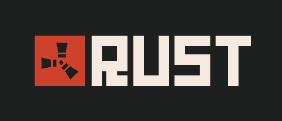
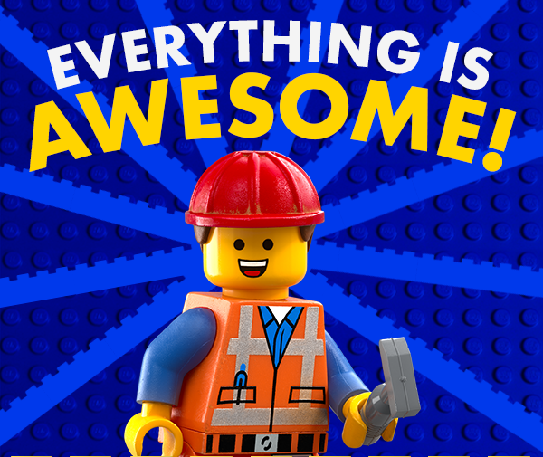
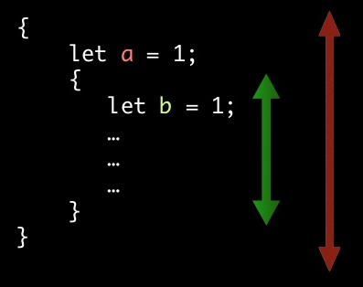

% Rust Workshop

Carlos Cobo Barredo

[@toqueteos](https://github.com/toqueteos)

November 11, 2016

# What is this workshop all about?

- Not about JavaScript
- Not full of cat pictures
- Learning something new you probably **won't use!**


# First doubts

Not this Rust!



**FUNNY FACT:** Every now and then a post about Rust (videogame) players appears on [/r/rust](https://reddit.com/r/rust). People just roll with it.

# Rust is

a systems programming language that

* runs blazingly fast,
* prevents segfaults,
* and guarantees thread safety.


Truth is.. You probably don't care. But that's OK!

# A true C++ replacement

```text
error: mismatched types: expected `&'a html5ever::tokenizer::Tokenizer<html5ever::tree_builder::TreeBuilder<dom::node::TrustedNodeAddress,dom::servohtmlparser::Sink>>`, found `&core::cell::RefCell<html5ever::tokenizer::Tokenizer<html5ever::tree_builder::TreeBuilder<dom::node::TrustedNodeAddress,dom::servohtmlparser::Sink>>>`
```

# Hello, Rust

```rust
fn main() {
    println!("Hello, world!");
}
```

```norust
> Hello, world!
```

# The End

That's all I have.


# History

* Started as a personal project in 2006 by Graydon Hoare (now at Microsoft)
* First compiler written in OCaml
* Mozilla took over the project 3 years later
* Compiler rewritten in Rust itself in 2010

# Why Rust at Mozilla?

* New experimental, highly parallel browser engine: Servo
* Browsers evolve in a hostile, highly concurrent environment
* Most security problems arise from memory safetey and concurrency issues
* Thus a safer, saner systems language is needed, with built-in concurrency

# Why Rust, for you?

* High-level features
* Low-level control
* Powerful FFI
* Direct memory control
* Guaranteed memory safety
* Concurrency without data races
* Zero cost abstractions


# High-level features

* Type inference
* Closures
* Iterators
* Algebraic data types
* Pattern matching
* Traits (= type classes)
* Macros
* Modules


# Low-level control

* Ability to trade compiler-enforced safety for lower-level control
* Eg. dereferencing raw pointer, pointer arithmetic, calling external code
* Such unsafe code must be surrounded by an `unsafe` block
* Thus easy to spot during code review or when debugging


# Powerful FFI

- Call Rust code from other languages
- Call _"C code"_ from Rust

_"C code"_? Bindings for libraries exposing a C interface

> FFI: Foreign Function Interface

_No GIF on this one, sorry._

# Direct memory control

* No garbage collector
* No runtime overhead
* No unpredictable pauses in execution
* Stack and heap allocations


# Recap

:blank:

# Recap


<small>
	<em>
		<a href="https://www.youtube.com/watch?v=GVNZtlI-kqU">source</a>
	</em>
</small>

You were just looking at the GIFs, were you?

# Diving in, neck first

* Primitive types
* Strings
* Variable bindings
* Functions
* Printing stuff
* Control structures
* Arrays, vectors and slices
* Structs and methods
* Enums
* Pattern matching

# Numeric types

<table>
    <tr>
        <th>Name</th>
        <th>Type</th>
        <th>Example</th>
    </tr>
    <tr>
        <td>(Un)Signed integer</td>
        <td><code>isize</code>, <code>usize</code></td>
        <td><code>-1337isize</code>, <code>9_001usize</code></td>
    </tr>
    <tr>
        <td>Unsigned integers</td>
        <td><code>u8</code>, <code>u16</code>, <code>u32</code>, <code>u64</code></td>
        <td><code>0b0010_0110u8</code>, <code>0xbeefu16</code>, <code>134_217_728u32</code>, ...</td>
    </tr>
    <tr>
        <td>Signed integers</td>
        <td><code>i8</code>, <code>i16</code>, <code>i32</code>, <code>i64</code></td>
        <td><code>-63i8</code>, ...</td>
    </tr>
    <tr>
        <td>Floating point</td>
        <td><code>f32</code>, <code>f64</code></td>
        <td><code>2.7182f32</code>, <code>-3.1_415f32</code></td>
    </tr>
</table>

# Primitive types

<table>
    <tr>
        <th>Name</th>
        <th>Type</th>
        <th>Example</th>
        <th></th>
    </tr>
    <tr>
        <td>Unit</td>
        <td><code>()</code></td>
        <td><code>()</code></td>
        <td></td>
    </tr>
    <tr>
        <td>Boolean</td>
        <td><code>bool</code></td>
        <td><code>true</code>, <code>false</code></td>
        <td></td>
    </tr>
    <tr>
        <td>Array</td>
        <td><code>[T]</code></td>
        <td><code>[1, 2, 3]</code>
        <td>fixed size</td>
    </tr>
    <tr>
        <td>Slice</td>
        <td><code>&[T]</code></td>
        <td><code>&[1, 2, 3]</code>
        <td><em>'view'</em> into an array</td>
    </tr>
    <tr>
        <td>Tuple</td>
        <td><code>(A, B, C...)</code></td>
        <td><code>(42u32, 1337i)</code></td>
        <td></td>
    </tr>

</table>

# Textual types

<table>
    <tr>
        <th>Name</th>
        <th>Type</th>
        <th>Example</th>
        <th></th>
    </tr>
    <tr>
        <td>Unicode scalar value</td>
        <td><code>char</code></td>
        <td><code>'a'</code></td>
        <td>32-bit unsigned word</td>
    </tr>
    <tr>
        <td>Unicode scalar array</td>
        <td><code>[char]</code></td>
        <td><code>['a', 'b', 'c']</code></td>
        <td>~ UTF-32 string</td>
    </tr>
    <tr>
        <td>Unicode string</td>
        <td><code>str</code>, <code>String</code></td>
        <td><code>"rust is cool"</code></td>
        <td>array of 8-bit unsigned bytes<br>
            ~ sequence of UTF-8 codepoints</td>
    </tr>
</table>

Most of the time you'll only use `&str` and `String`.

# Why `&str` vs `String`?

- `&'static str` is **inmutable** and is stored directly on the final binary. Don't panic yet!
- `&str` is **inmutable**, a buffer and a length.
- `String` is **mutable**, a buffer, a length and a capacity.

Basically, performance.

- Going from `&str` to `String` is **expensive**.
- Going from `String` to `&str` is **cheap**.

There's [a lot more](http://is.gd/hQ7M5O), like where they get allocated, but we don't care for now.

# Strings: common mistakes

```rust
let s = "hello";

println!("The first letter of s is {}", s[0]);
```

This **won't work**.

# Strings: UTF-8

Why? See it for yourself

```
let hachiko = "忠犬ハチ公";

for b in hachiko.as_bytes() {
    print!("{}, ", b);
}
// Will print:
// 229, 191, 160, 231, 138, 172, 227, 131, 143, 227, 131, 129, 229, 133, 172,

for c in hachiko.chars() {
    print!("{}, ", c);
}
// Will print:
// 忠, 犬, ハ, チ, 公,
```

[Playpen](http://is.gd/eKksRX)

# Break time!

**No more tables ahead.**

Question time! Everything clear until now?

Don't be like this:


# Variable bindings

```rust
let x: i32 = 5;

// type annotations are (usually) optional
let x = 5i32;

let y = "foo!";
```

# Mutability (1/3)

```rust
let x = 5i32;

x = x + 1; // error
```

# Mutability (2/3)

```rust
let mut x = 5i32;

x = x + 1; // ok
```

# Mutability (3/3)

```rust
let x = 5i32;
let mut y = x;

y = y + 1;
```

Will this work?

# Mutability (NaN/3)

```rust
let x = 5i32;
let mut y = x;

y = y + 1; // ok
```

Will this work? **YES.**


[Playpen](http://is.gd/7NBoAk)

# Functions

```rust
fn main() {
    let res = do_stuff(2, 3);
    println!("result is {}", res);
}

fn do_stuff(a: int, b: int) -> int {
    let c = a + b;

    return c * 2;
}
```

# Functions

```rust
fn do_stuff(a: int, b: int) -> int {
    let c = a + b;
    return c * 2;
}

fn do_same_stuff(a: int, b: int) -> int {
    let c = a + b;
    c * 2
}
```

WAT

# Printing stuff

```rust
fn main() {
    let name = "Curro";
    let age = 40;

    println!("{} is {}", name, age);
}
```

> `println!()` is actually a macro, not a function.

# Printing stuff

We can re-order arguments by putting their index inside the braces.

```rust
fn main() {
    let name = "Curro";
    let age = 40;

    println!("{1} is {0}", age, name);
}
```

# Conditionals

```rust
if age > 18 {
    println!("Have a beer!");
} else {
    println!("Sorry, no beer for you.");
}
```

> No parenthesis around the condition!

# Conditionals: The ugly

Who hasn't seen/written something like this?

```rust
let message = "Never seen in production :joy:";
if health > 0 {
    message = "Alive";
} else {
    message = "Dead";
};

println!("Status: {}", message);
```

# Conditionals: The cool

`if/else` is an expression!

```rust
let message = if health > 0 {
    "Alive"
} else {
    "Dead"
};

println!("Status: {}", message);
```

# Operators

The [usual](https://doc.rust-lang.org/reference.html#unary-operator-expressions) ones.

**GOTCHA:** There's no increment/decrement!

```rust
let a = 2i32;
let b = -3i32;

a += 1;
b -= 1;

// Won't work:
// a++
// b--
```

# While

```rust
while x < 10 {
    // do stuff
}
```

# Loop

```rust
loop {
    // do stuff
}
```

Same as `while true` but generates better code for some cases!

# For

```rust
for var in expression {
    code
}
```

> `expression` must be an `Iterator` (that's for another day).

# For

Classic for loop:

```c
for (int i = 1; i < 10; i++) {
	printf("%d\n", i);
}
```

In Rust:

```rust
for number in 1..10 {
    println!("{}", number)
}
```

# Break time!



# Cargo: A super fast introduction

Cargo is Rust's **one and only** package manager. It:

* gets and compiles external dependencies
* builds your projects, also can run them if you want
* ensures you’ll always get a repeatable build
* runs your tests
* runs your benchmarks
* runs any other command you want (since v1.5), if that's your thing

Use Cargo for all your projects.

# Cargo: Getting started

Hurray, yet another package manager **YOU** have to learn!

Good news is, we don't care right now.

We just want to run some Rust code!

# Cargo: Creating a project

```norust
$ cargo new hello_world --bin
$ cd hello_world
$ tree -i -f .
.
./Cargo.toml
./src
./src/main.rs

1 directory, 2 files
```

# Cargo: Project done, now what?

```norust
$ cargo run
   Compiling hello_world v0.1.0 (file:///tmp/code/rust/hello_world)
     Running `target/debug/hello_world`
Hello, world!
```

As simple as that!

# Cargo: `run` vs `build`

We could also call `cargo build` and manually run `target/debug/hello_world`.

> See that `debug` on the path? That's because we didn't turn on optimizations!

# Exercise #1: Fibonacci

```rust
fn fib(n: u32) -> u32 {
	// HALF A METER BEARD REQUIRED
	// ...
	// DARK ARCANE CODING ARTS
}

fn main() {
	let f = fib(10); // f should be 55
	println!("The 10th Fibonacci number is {}", f);
}
```

You have 5 minutes guys or until everyone gets it right.

[Solution](http://is.gd/7Y25ik)

# Status report

Fibonacci was too easy?

Ok, let's step up our game...

# Arrays, vectors and slices

* An array is a **fixed-sized** list of elements of the same type
* A vector is a **dynamic, growable** array
* A slice is a reference to an array.

# Arrays

An array is a **fixed-sized** list of elements of the same type.

```rust
let a = [1, 2, 3];   // a: [i32; 3]
let b = [1u8, 2, 3]; // b: [u8; 3]

println!("a has {} elements", a.len());
println!("the first element of b is {}", b[0]);
```

# Vectors

A vector is a **dynamic, growable** array

```rust
let mut names = vec!["Adolfo", "Chema"];

names.push("Jose Luis");

// names[2] == "Jose Luis";
```

# Vectors

```rust
let names = vec!["Manu", "Chickenman"];

names.push("Paco Jones");
```

This **won't work!**

```norust
<anon>:5:5: 5:10 error: cannot borrow immutable local variable `names` as mutable
<anon>:5     names.push("Paco Jones");
             ^~~~~
<anon>:3:9: 3:14 help: to make the local variable mutable, use `mut` as shown:
<anon>:      let mut names = vec!["Manu", "Chickenman"];
error: aborting due to previous error
```

We forgot the `mut` so obviously we can't `push` into a inmutable vector.

# Slices

A slice is a **reference** to an array.

A slice allows safe and efficient access to a portion of an array without copying.

```rust
let a = [0, 1, 2, 3, 4];

// A slice containing all of the elements in a
let complete = &a[..];

// A slice with just the elements 1, 2, and 3 in a
let middle = &a[1..4];
```

# Exercise #2: Tic Tac Toe


Rules:

- Players randomly draw their sign.
- 3x3 board

Time is limited so use these:

- https://github.com/toqueteos/rw/archive/master.zip
- `git clone https://github.com/toqueteos/rw`

# Structs and methods

- Structured programming
- Object Oriented Programming

**Welcome to 1980!**

# Structs

```rust
struct Rectangle {
    width: f32,
    height: f32
}

struct Rocket {
	dead_monkeys: i32,
	wheels: i32,
	astronauts: f64,
	exploded: bool
}
```

# Methods: Question

What's a **static** method?

# Methods: Question

What's a **static** method?

And a **member** method?

# Methods

Methods (static and members) are defined inside an `impl` block.

```rust
struct Rectangle {
    width: f32,
    height: f32
}

impl Rectangle {
    // Methods here.
}

```

# Static methods

Static methods are defined this way, and can be called with `Type::method_name()`.

```rust
impl Rectangle {
    fn new(width: f32, height: f32) -> Rectangle {
        Rectangle { width: width, height: height }
    }
}

fn main() {
    let rect = Rectangle::new(1.2, 4.9);
    println!("{}", react.area());
}
```

# Member methods

Member methods take a `&self` parameter, which is a reference to the `struct` the method is called on.

```rust
impl Rectangle {
    fn area(&self) -> f32 {
        self.width * self.height
    }
}

fn main() {
    let rect = Rectangle::new(1.2, 4.9);
    let area = react.area();

    println!("{}", area);
}
```

# Break time!

I probably need some water by now...

Come on guys, go to the bathroom.


# Guaranteed memory safety

* No buffer overflows
* No dangling pointers

# Concurrency without data races

* Only immutable data can be shared
* Shared data must remain alive as long as any task might access it

# Zero cost abstractions

Memory safety is enforced during compilation, there is no runtime overhead.

# But how?

Rust is built around 3 concepts:

* Lifetime
* Ownership
* Borrowing

# Lifetimes

Time span during which a resource (value) is valid.

Seems trivial. **IT IS NOT**.

# Lifetimes



* You can think of it as a scope.
* At the end of its lifetime, a value will be deallocated.

# Lifetimes

```c
{
    int *x = malloc(sizeof(int));

    *x = 5;

    free(x);
}
```

# Lifetimes

```rust
{
    let x = 5i32;

    // x gets deallocated here
    // x dies horribly
}
```

# Move & Copy

When you pass data to a function (or even assign it to a variable), that data can be copied, moved, or borrowed (more about it soon).

# Move & Copy: Question

Copy? Move? What's that?!

Raise your hand!


# Copy

```rust
fn main() {
    let a = 5;
    let b = add_one(a);
    println!("{}", a);
}

fn add_one(x: i32) -> i32 {
    x + 1
}
```

# Move

```rust
struct Person {
    name: String,
    age: u32
}

fn main() {
    let john = Person { name: "John".to_string(), age: 42 };
    show(john);

    // `john` has already been deallocated
}

fn show(person: Person) {
    println!("{} is {}", person.name, person.age);

    // `john` will be deallocated here
}
```

# Move

```rust
struct Person {
    name: String,
    age: u32
}

fn main() {
    let john = Person { name: "John".to_string(), age: 42 };
    show(john);
    show(john);
}

fn show(person: Person) {
    println!("{} is {}", person.name, person.age);

    // `john` will be deallocated here
}
```

# Move

```norust
<anon>:9:10: 9:14 error: use of moved value: `john` [E0382]
<anon>:9     show(john);
                  ^~~~
<anon>:9:10: 9:14 help: see the detailed explanation for E0382
<anon>:8:10: 8:14 note: `john` moved here because it has type `Person`, which is non-copyable
<anon>:8     show(john);
                  ^~~~
error: aborting due to previous error
```

# Move

```rust
fn main() {
    let john = Person { name: "John".to_string(), age: 42 };

    // `john` moves into show here
    show(john);
    // `john` is deallocated by now
    // so the next line doesn't compile
    show(john);
}

fn show(person: Person) {
    println!("{} is {}", person.name, person.age);

    // `john` will be deallocated here
}
```

# Move (assignment)

Assigning a value to a variable is similar to passing it to a function.

```rust
fn main() {
    let john = Person { name: "John".to_string(), age: 42 };

    // `john` moves into `john_bis` here
    let john_bis = john;

    // so the next line won't compile
    show(john);
}

fn show(person: Person) {
    println!("{} is {}", person.name, person.age);

    // `john` will be deallocated here
}
```

# Break time!

More water!

Questions? Bathroom break?


# Ownership & Borrowing

When you create a resource, you're the **owner** of that resource.

Being an owner gives you some privileges:

* You control when that resource is deallocated.
* You may lend that resource, **immutably**, to **as many** borrowers as you'd like.
* You may lend that resource, **mutably**, to a **single** borrower.

# Ownership & Borrowing

But it also comes with some restrictions:

* If someone is borrowing your resource (either mutably or immutably), you may not mutate the resource or mutably lend it to someone.
* If someone is mutably borrowing your resource, you may not lend it out at all (mutably or immutably) or access it in any way.

# Borrow

> You may lend that resource, **immutably**, to **as many** borrowers as you'd like.

```rust
fn main() {
    let john = Person { name: "John".to_string(), age: 42 };

    // `john` moves into `show`.
    show(&john);

    // `show` hands us `john` back.
    show(&john);
    // the previous line will thus compile.
}

fn show(person: &Person) {
    println!("{} is {}", person.name, person.age);
}
```

# Borrow

```norust
John is 42
John is 42
```

# Mutable borrow

> You may lend that resource, **mutably**, to a **single** borrower.

```rust
fn main() {
    let mut john = Person { name: "John".to_string(), age: 42 };

    grow_older(&mut john);

    show(&john); // John is 43
}

fn grow_older(person: &mut Person) {
    person.age += 1;
}
```

# Mutable borrow

The following will compile too, as `grow_older` gives us `john` back:

```rust
fn main() {
    let mut john = Person { name: "John".to_string(), age: 42 };
    show(&john); // John is 42
    grow_older(&mut john);
    grow_older(&mut john);
    show(&john); // John is 44
}
```

# Mutable borrow

But this won't:

```rust
fn main() {
    let mut john = Person { name: "John".to_string(), age: 42 };

    let mut john_bis = &mut john;

    grow_older(&mut john);

    show(&john);
}
```

# Mutable borrow

Let's see the error in a _live_ environment: http://is.gd/CW3zaG

```norust
<anon>:11:21: 11:25 error: cannot borrow `john` as mutable more than once at a time [E0499]
<anon>:11     grow_older(&mut john);
                              ^~~~
<anon>:11:21: 11:25 help: see the detailed explanation for E0499
<anon>:9:29: 9:33 note: previous borrow of `john` occurs here; the mutable borrow prevents subsequent moves, borrows, or modification of `john` until the borrow ends
<anon>:9     let mut john_bis = &mut john;
                                     ^~~~
<anon>:14:2: 14:2 note: previous borrow ends here
<anon>:6 fn main() {
...
<anon>:14 }
          ^
<anon>:13:11: 13:15 error: cannot borrow `john` as immutable because it is also borrowed as mutable [E0502]
<anon>:13     show(&john);
                    ^~~~
<anon>:9:29: 9:33 note: previous borrow of `john` occurs here; the mutable borrow prevents subsequent moves, borrows, or modification of `john` until the borrow ends
<anon>:9     let mut john_bis = &mut john;
                                     ^~~~
<anon>:14:2: 14:2 note: previous borrow ends here
<anon>:6 fn main() {
...
<anon>:14 }
          ^
error: aborting due to 2 previous errors
```

# Mutable borrow

```rust
fn main() {
    let mut john = Person { name: "John".to_string(),
                            age: 42 };

    // first borrow of `john` as mutable
    let mut john_bis = &mut john;

    // `john` cannot be mutably borrowed again, won't compile
    grow_older(&mut john);

    show(&john);
}
```

# High-level features


# Closures

```rust
let plus_one = |x: i32| x + 1;

plus_one(2) // 2
```

```rust
let plus_two = |x| {
    let mut result: i32 = x;

    result += 1;
    result += 1;

    result
};

plus_two(2) // 4
```

# Closures

```rust
let factor = 8;
let xs = vec!(1i32, 2, 3);
let ys = xs.iter().map(|x| x * factor);

// ys == [8, 16, 24]
```

# Enums

* Also called `sum types` in the literature.
* Similar to Haskell's `data` and Scala's `case class`.

```rust
enum Boolean {
    True,
    False
}
```

> Rust's `bool` type is **not** implemented this way as it is a primitive.

# Enums

```rust
enum Boolean {
    True,
    False
}

let b: Boolean = True;
```

A value of type `Boolean` can be either `True` or `False`.

# Enum

From the standard library (almost):

```rust
enum Ordering { Less, Equal, Greater }

fn cmp(a: i32, b: i32) -> Ordering {
    if      a < b { Less }
    else if a > b { Greater }
    else          { Equal }
}

let ordering = cmp(x, y);

if ordering == Less {
    println!("less");
} else if ordering == Greater {
    println!("greater");
} else if ordering == Equal {
    println!("equal");
}
```

# Pattern matching

Rust provides pattern matching, which lets you rewrite this:

```rust
if ordering == Less {
    println!("less");
} else if ordering == Greater {
    println!("greater");
} else if ordering == Equal {
    println!("equal");
}
```

# Pattern matching

as this:

```rust
match ordering {
    Less    => println!("less"),
    Greater => println!("greater"),
    Equal   => println!("equal")
}
```

# Pattern matching

It also works with primitives:

```rust
let i = 5i32;

match i {
    0 => println!("zero"),
    1 => println!("one"),
    _ => println!("> 1")
}
```

# Pattern matching

Patterns must be exhaustive:

```rust
match ordering {
    Less    => println!("less"),
    Greater => println!("greater")
}
```

> error: non-exhaustive patterns: `Equal` not covered [E0004]

# Pattern matching

There's a "catch-all" pattern: `_`.

```rust
match ordering {
    Less => println!("less"),
    _    => println!("not less")
}
```

> error: non-exhaustive patterns: `Equal` not covered [E0004]

# Back to enums

Enums can also store data. One simple example is the built-in `Option` type. Here's how it is defined in the standard library:

```rust
enum Option<T> {
    None,
    Some(T),
}
```

The type `Option<T>` represents an optional value of type `T`.

An `Option` is either

* `Some`, and contains a value of type `T`
* `None`, and does not contain anything

# Option

```rust
let opt: Option<i32> = Some(5);

let opt_plus_two = opt + 2;
```

> error: binary operation `+` cannot be applied to type `core::option::Option<i32>`

# Option

To make use of the value inside an `Option`, we must pattern-match on it:

```rust
let opt: Option<i32> = Some(5);

let opt_plus_two = match opt {
    Some(x) => x + 2,
    None    => -1
}
```

This forces us to handle the case where there might be no value.

# Option

Options have a number of uses in Rust:

* Initial values
* Return values for functions that are not defined over their entire input range (partial functions)
* Return value for otherwise reporting simple errors, where None is returned on error
* Optional struct fields
* Optional function arguments
* Nullable pointers

# Option

`Option` also provides a few convenience methods:

* `fn is_some(&self) -> bool`
* `fn is_none(&self) -> bool`
* `fn unwrap_or(self, def: T) -> T`
* `fn unwrap(self) -> T` **Use with caution**

# Option

A couple more:

* `fn map<U, F>(self, f: F) -> Option<U>
      where F: FnOnce(T) -> U`
* `fn and_then<U, F>(self, f: F) -> Option<U>
      where F: FnOnce(T) -> Option<U>`

# Option

```rust
fn get_name() -> Option<String> { /* ... */ }

let name: Option<String> = get_name();

let display_name = name.map(|n| format!("My name is {}", n))
                       .unwrap_or("I don't have a name");

println!(display_name);
```

If `get_name()` returns `Some("Marie")`, this will print `My name is Marie`, and if it returns `None`, this will print `I don't have a name`.

# Break time!

More water!

Questions? Bathroom break?


# Traits

* No inheritance in Rust :)
* No interfaces either...
* Instead Rust provides a mechanism called `traits`.

# Traits

A trait is a sort of interface that defines some behavior.
If a type implements a trait, that means that it supports and implements the behavior the trait describes.

# Traits

You can think of them as (better) Java interfaces. They are in fact very similar to Haskell's typeclasses.

One of the main differences is that you can define a trait implementation separately from the struct definition, even in another module. This means that you can eg. implement a trait you defined yourself for a type provided by a library.

They're also much more powerful (but won't get into too much detail here).

# Traits

```rust
struct Rectangle { width: f32, height: f32 }

trait HasArea {
    fn area(&self) -> f32;
}

impl HasArea for Rectangle {
    fn area(&self) -> f32 {
        self.width * self.height
    }
}
```

# Traits

```rust
fn main() {
    let rect = Rectangle {
        width: 1.2,
        height: 4.9
    };
    println!("{}", react.area());
}
```

# Traits

```rust
struct Circle { radius: f32 }

impl HasArea for Circle {
    fn area(&self) -> f32 {
        std::f32::consts::PI * (self.radius * self.radius)
    }
}
```

# Traits

```rust
fn print_area<T>(shape: T) {
    println!("This shape has an area of {}", shape.area());
}
```

> error: type `T` does not implement any method in scope named `area`

# Traits

```rust
fn print_area<T: HasArea>(shape: T) {
    println!("This shape has an area of {}", shape.area());
}
```

# Traits

```rust
fn print_area<T: HasArea>(shape: T) {
    println!("This shape has an area of {}", shape.area());
}

fn main() {
    let c = Circle { radius: 1.0 };
    let r = Rectangle { width: 3.0, height: 2.0 };

    print_area(c);
    print_area(r);
}
```

> This shape has an area of 3.141592654
> This shape has an area of 6.0

# Traits

```rust
print_area(10i32);
```

> error: the trait `HasArea` is not implemented for the type `i32`

# Traits

We can implement traits for any type. So this would work, even if it makes no sense:

```rust
impl HasArea for i32 {
    fn area(&self) -> f32 {
        println!("this is silly");
        *self as f32
    }
}

fn main() {
    10i32.area();
    print_area(10i);
}
```

Implementing traits for primitive types should generally be avoided.

# Traits

One restriction:

> Either the trait or the type you're writing the `impl` for must be inside your crate (i.e. your library).

# Exercise #3: Battleship


Rules:

- Two players
- Each player has two 10x10 grids
- Whatever strategy you want

I'll setup a matchmaking server to test implementations and find who's best!

More details soon :)

# Iterators

```rust
for x in 0i32..10 {
    // do stuff
}
```

`Iterator<T>` provides a `next()` function that we can call repeatedly to get a sequence of values, each wrapped in `Some`. When no more values are available, `next()` returns `None`.

# Iterators

The `for` loop on the previous slide can be written like this:

```rust
let mut range = 0i32..10;

loop {
    match range.next() {
        Some(x) => {
            println!("{}", x);
        },
        None => { break }
    }
}
```

# Iterators

Vectors can be iterated over too. `Vec<T>` provides an `iter()` method which returns an `Iterator<&T>` that we can use to iterate over the elements.

```rust
let nums = vec![1i32, 2, 3];

for num in nums.iter() {
    println!("{}", num);
}
```

# Iterators

`Iterator` provides methods such as `map`, `filter`, `take`, and friends.

# Consumers

`Iterator`s are not collections, they just allow to iterate over a (potentially infinite) sequence of elements.

It is possible to turn an `Iterator` into a collection with the `collect` method.

```rust
let a = [1i32, 2, 3, 4, 5];
let iter = a.iter().map(|&x| x + 1);

let a_plus_one: Vec<i32> = iter.collect();
// a_plus_one = [2i32, 3, 4, 5, 6];
```

The type annotation is mandatory. `let a_plus_one = iter.collect();` would throw an error.

# Macros

You have already seen them. `println!()` is a macro. They're distinguishable by the `!` at the end of the function name.

For another talk!

# Crates and modules

A "crate" in Rust is what you'd call a "package" or "library" in other languages. A crate contains modules (which can contain other modules).

If we have a `greetings` crate that contains a public module `english` that defines a public method `hello()`, we'd use it like this:

```rust
extern crate greetings;

fn main() {
	greetings::english::hello();
}
```
# Modules

The `use` keyword imports names in the local scope.

```rust
extern crate greetings;
use greetings::english;

fn main() {
	english::hello();
}
```

# Thank you!

Questions?

# References

* https://doc.rust-lang.org/stable/book/
* https://github.com/kmcallister/sliderust
* A lot more I forgot to note down
